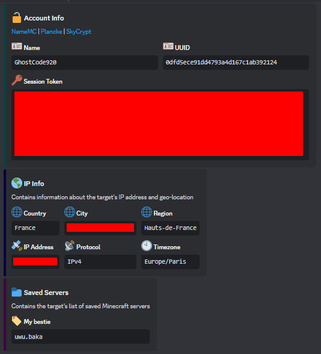
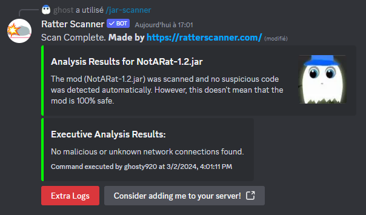
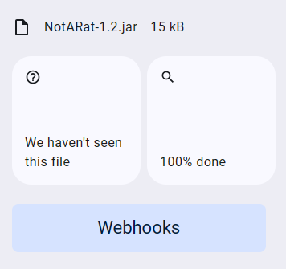
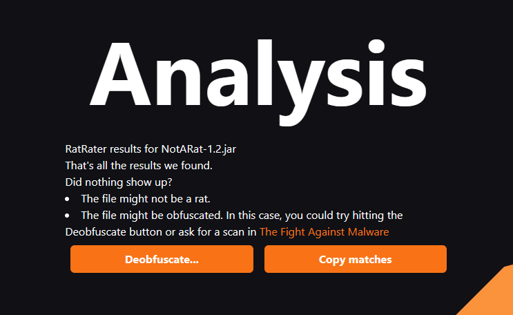
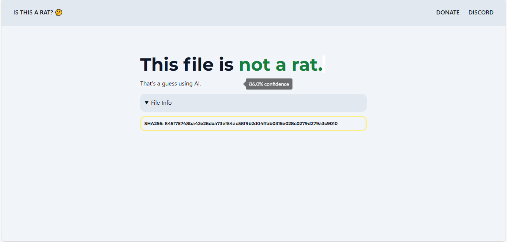

# Not A Rat
[Click here to go to the download page to test it by yourself.](https://github.com/Ghosty920/NotARat/releases/latest)

**This project is for educational purposes only.**

Not A Rat is a Forge mod, which logs your token while being undetected by [isthisarat](https://isthisarat.com/), [ratterscanner](https://ratterscanner.com/) (they are the most popular by far, but not a single detector can find Not A Rat).

This mod wasn't made to be used as a Rat but just an example of how dumb these websites are, and how dumb most Rats are (if we ignore obfuscated ones that obviously are detected).

What is following is some blabla, but if you still want to read to know "a bit more about this project", then keep reading ig.

Rat makers just think people won't put them into a website ([even tho there are still people putting Skytils](https://cdn.discordapp.com/attachments/942860271825875025/1213171828093100142/image.png?ex=65f4814f&is=65e20c4f&hm=d5a685536d7a5ab19b565cab2577c73c519d43bb6b3abd202505d1f488ba532e&)) but there's more and more people that do it, so I give them a free solution :)

No jokes, if som1 smart enough see this, just report it to the website admins, or just use my code to do whatever you want. Also if you find a website/just anything that detects it as a Rat, PLEASE [open an issue](https://github.com/Ghosty920/NotARat/issues/new) or contact me on my discord @ghosty920, I'll love the move!

If you have free time, just test it by yourself, and, maybe, over time it'll start to become detected, right?

PS: It isn't tested on Pizza Client but it should work. Also I do not plan on adding a password stealer as I just made this to showcase how to destroye detectors, not to be really used.

## Yes A Rat
In the Releases, I also put a YesARat file. This file is exactly the same code as NotARat but without using Reflection.

So if you want to test it in a rat detector, it'll be detected, even tho it's exactly the same thing. GG [isthisarat](https://isthisarat.com/) ig…

## All Websites this was tested on
- [Ratter Scanner](https://ratterscanner.com/)
  

- [Rat Rater 2](https://ktibow.github.io/RatRater2/)

- [Rat Rater](https://ktibow.github.io/RatRater/)

- [isthisarat](https://isthisarat.com/)
  

If you see that a detector is missing, even if it doesn't bypass, please tell me.

### TODO List
- mcmod.info (+ build fk)