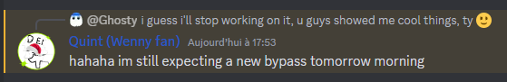
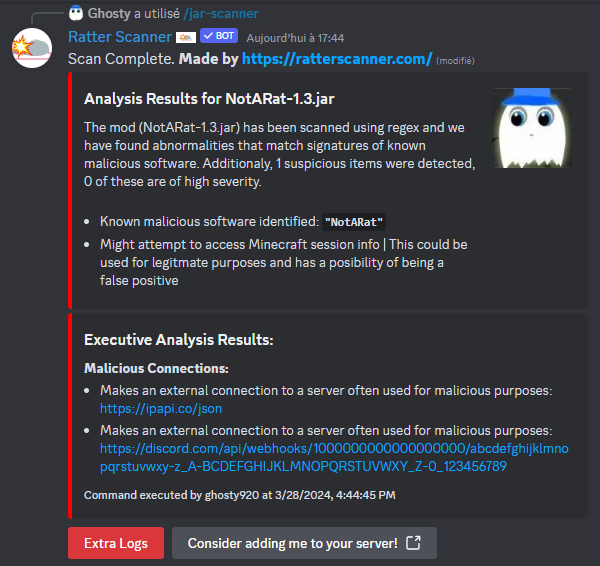

# Not A Rat
[Click here to go to the download page to test it by yourself.](https://github.com/Ghosty920/NotARat/releases/latest)

**This project was and is for educational purposes only.**

**This project is discontinued. If you have any issue regarding it, or you want it to be updated, do not contact me.**

Not A Rat is a Forge mod, which logs your token while being undetected by [isthisarat](https://isthisarat.com/), and previously [ratterscanner](https://ratterscanner.com/) (they are the most popular by far, but not a single detector could find Not A Rat).

*Ps: Saved Servers was then removed because considered useless by myself.*

This mod wasn't made to be used as a Rat but just an example of how dumb these websites can be, and how dumb most Rats are.

Rat makers just think people won't put them into a website ([even tho there are still people putting Skytils](https://cdn.discordapp.com/attachments/942860271825875025/1213171828093100142/image.png?ex=65f4814f&is=65e20c4f&hm=d5a685536d7a5ab19b565cab2577c73c519d43bb6b3abd202505d1f488ba532e&)) but there's more and more people that do it, and some are smart enough to try going through scanner flags.

This mod is a showcase of what we can easily do without obfuscation to prevent a mod from being detected as a Rat. 

## Why archiving this?
- **1-** My goal was not for it to be used as a Rat (I didn't care, but as people came into my dms without even starring the project 😥, I decided it was enough)
- **2-** Ratter Scanner developers are very cool! Honestly, it was fun talking with these guys, seeing what they were capable of. Thank you Quint 💙
- **3-** I have school. Literally, this project was fun to work on, but it took too much time to setup, update... I now get bored of this, and if I came to write this, it is what it is.

If you still want to test it (not to use it for any malicious reason), do so, and please use [Ratter Scanner](https://ratterscanner.com/) to check any file you receive and you do not feel safe. Even stuff on github like [CrimsonHelper aka CrimsonTool](https://github.com/Crimsontool/crimsontool-/) that are blatant Rats but that people may not check because "ay, it's open source 😉".

lol

my goal is completed ig, i'm famous

## All Websites this was tested on
- [Ratter Scanner](https://ratterscanner.com/) (now flags, forever.)
  

- [Rat Rater 2](https://ktibow.github.io/RatRater2/)

- [Rat Rater](https://ktibow.github.io/RatRater/)

- [isthisarat](https://isthisarat.com/)
  
